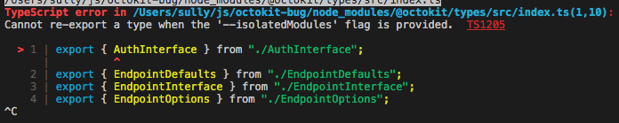

# Import Error Reproduction

You can clone this repo and run:

```s
$ npm i
$ npm run start
```

to verify an issue with the `@octokit/types` library when used with the `--isolatedModules` flag, which is required for `babel` & `create-react-app` (https://github.com/facebook/create-react-app/issues/6054).  I tested this on Typescript at 3.6.3 and 3.7.2.  



This reproduction triggers the error with the following line in `App.tsx`:

```typescript
import { Types } from '@octokit/auth-oauth-app';
```

If you trace it back, the import tree leads you to `@octokit/types`, where this export syntax in `src/index.ts`:

```typescript
export { Name } from './Name';
```

leads to the issue above, but if it's updated to

```typescript
export * from './Name'
```

then there are no errors.  The files in `@octokit/types/src` all just import one type apiece, so it works out the same.
